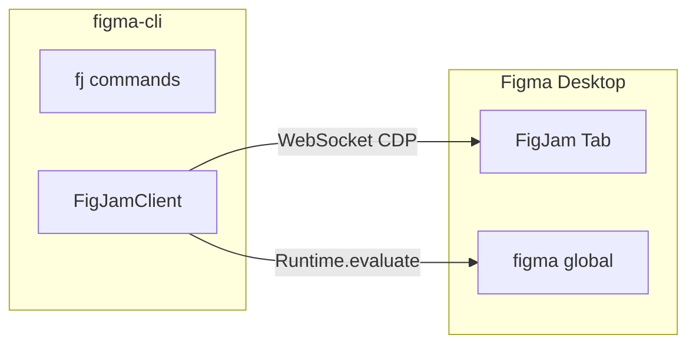

# FigJam
#figma-cli #guia #figjam

> [!IMPORTANT]
> O FigJam usa um cliente CDP próprio (`FigJamClient`), independente do `figma-use`. A biblioteca `figma-use` crasha no FigJam porque a sua Plugin API difere do Figma Design.

---

## Comandos CLI

```bash
# Listar páginas FigJam abertas
node src/index.js fj list

# Info da página actual
node src/index.js fj info

# Listar nodes da página
node src/index.js fj nodes
node src/index.js fj nodes --limit 50

# Criar sticky note
node src/index.js fj sticky "Hello World!" -x 100 -y 100
node src/index.js fj sticky "Nota amarela" -x 200 -y 100 --color "#FEF08A"

# Criar shape com texto
node src/index.js fj shape "Caixa" -x 100 -y 200 -w 200 -h 100
node src/index.js fj shape "Diamante" -x 300 -y 200 --type DIAMOND

# Criar texto
node src/index.js fj text "Texto livre" -x 100 -y 400 --size 24

# Ligar dois nodes
node src/index.js fj connect "2:30" "2:34"

# Mover, actualizar, eliminar
node src/index.js fj move "2:30" 500 500
node src/index.js fj update "2:30" "Novo texto"
node src/index.js fj delete "2:30"

# Eval directo
node src/index.js fj eval "figma.currentPage.children.length"
```

Todos os comandos suportam `-p` / `--page` para seleccionar uma página específica:
```bash
node src/index.js fj sticky "Nota" -p "My Board" -x 100 -y 100
```

---

## Tipos de shapes

| Tipo | Descrição |
|------|-----------|
| `ROUNDED_RECTANGLE` | Default |
| `RECTANGLE` | Rect sem arredondamento |
| `ELLIPSE` | Círculo/elipse |
| `DIAMOND` | Losango |
| `TRIANGLE_UP` | Triângulo para cima |
| `TRIANGLE_DOWN` | Triângulo para baixo |
| `PARALLELOGRAM_RIGHT` | Paralelogramo direita |
| `PARALLELOGRAM_LEFT` | Paralelogramo esquerda |

---

## Opções por comando

| Comando | Flags |
|---------|-------|
| `sticky <text>` | `-x`, `-y`, `-c/--color`, `-p/--page` |
| `shape <text>` | `-x`, `-y`, `-w/--width`, `-h/--height`, `-t/--type`, `-p/--page` |
| `text <content>` | `-x`, `-y`, `-s/--size`, `-p/--page` |
| `connect <start> <end>` | `-p/--page` |
| `move <id> <x> <y>` | `-p/--page` |
| `update <id> <text>` | `-p/--page` |
| `delete <id>` | `-p/--page` |
| `eval <code>` | `-p/--page` |
| `nodes` | `-l/--limit`, `-p/--page` |

---

## Arquitectura do FigJamClient



**Como funciona:**
1. `FigJamClient.listPages()` faz fetch a `http://localhost:9222/json`
2. Conecta ao WebSocket da página FigJam pretendida
3. Activa o domínio `Runtime`
4. Encontra o contexto de execução com o global `figma`
5. Executa JS via `Runtime.evaluate`

**Código:** `src/index.js` → secção `fj` / `figjam` commands

---

## Diferenças entre Figma Design e FigJam

| Feature | Figma Design | FigJam |
|---------|--------------|--------|
| `figma.editorType` | `"figma"` | `"figjam"` |
| Sticky notes | Não disponível | `figma.createSticky()` |
| Connectors | Não disponível | `figma.createConnector()` |
| Shape with text | Não disponível | `figma.createShapeWithText()` |
| Variables | Suporte completo | Limitado |
| Auto Layout | Suporte completo | Não disponível |

---

## Problemas conhecidos

> [!WARNING]
> Algumas páginas FigJam não expõem o contexto `figma` imediatamente. Pode estar relacionado com o estado de carregamento da página ou tamanho do ficheiro. Solução: refrescar a página FigJam no Figma Desktop.
