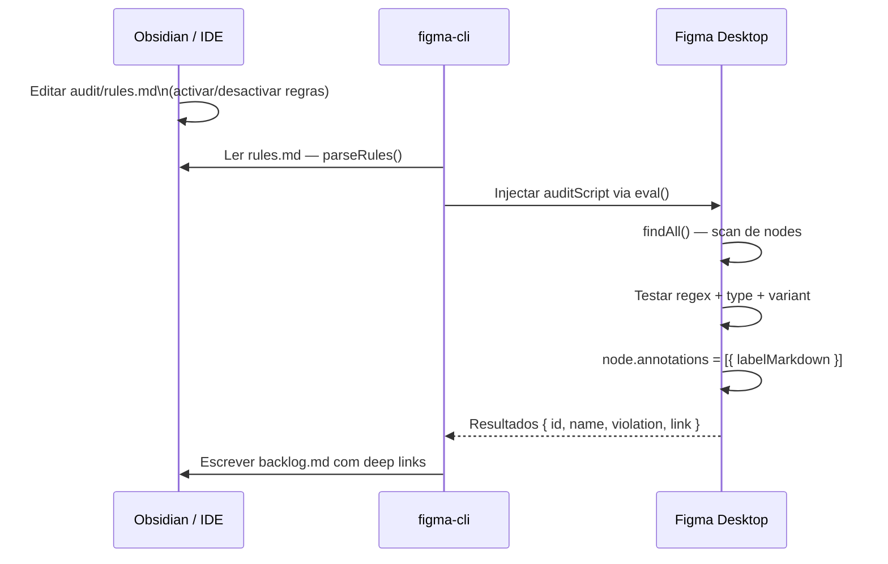

# Motor de Audit
#figma-cli #arquitectura #audit #anotações #obsidian

> [!NOTE]
> O sistema de audit lê regras de `audit/rules.md`, corre um scan no Figma e escreve **anotações nativas** nos nodes. Gera também um backlog em `audit/backlog.md` com deep links para o Figma Desktop.

---

## Fluxo completo



---

## Formato de regras (`audit/rules.md`)

```markdown
- [x] [ID] [Mensagem na flag] regex: padrão
- [x] [ID] [Mensagem na flag] regex: padrão type: TIPO_NODE
- [x] [ID] [Mensagem na flag] regex: padrão type: COMPONENT_SET variant: disabled
- [ ] [ID] [Mensagem na flag] regex: padrão
```

| Campo | Obrigatório | Exemplo |
|-------|-------------|---------|
| `[x]` / `[ ]` | Sim | `[x]` = activo, `[ ]` = desactivado |
| `[ID]` | Sim | `[ERR_UNNAMED]` |
| `[Mensagem]` | Sim | `[Component Set sem nome semântico]` |
| `regex:` | Sim | `^(Frame\|Group)\\s\\d+$` |
| `type:` | Não | `COMPONENT_SET`, `FRAME`, `TEXT`, etc. |
| `variant:` | Não | `disabled`, `hover`, etc. |

> [!IMPORTANT]
> Conteúdo dentro de blocos ` ``` ` é ignorado pelo parser — exemplos de código não são interpretados como regras.

> [!NOTE]
> **Sintaxe única:** o parser aceita **apenas** o formato `- [x]` / `- [ ]`. Sintaxes antigas (espaço antes do `-`, `~~`) não são reconhecidas. Usa o Obsidian ou qualquer editor de texto para clicar nos checkboxes.

---

## Parser de regras

**Como funciona:**
1. Lê `audit/rules.md` (ou path custom com `--rules`)
2. Ignora linhas dentro de code blocks (` ``` `)
3. Para cada linha: detecta `- [x]` (activa) ou `- [ ]` (desactivada — ignorada)
4. Extrai `id`, `message`, `pattern`, `nodeType`, `variant` via regex

**Código:** `src/index.js` → função `parseRules()` (comando `audit`)

```javascript
let inCodeBlock = false;
content.split('\n').forEach(line => {
  if (line.trimStart().startsWith('```')) { inCodeBlock = !inCodeBlock; return; }
  if (inCodeBlock) return;
  const checkboxMatch = line.match(/^-\s*\[( |x)\]\s*(.*)/i);
  if (!checkboxMatch || checkboxMatch[1] === ' ') return;
  const match = checkboxMatch[2].match(
    /\[(.*?)\]\s*\[(.*?)\]\s*regex:\s*(.+?)(?:\s+type:\s*(\S+))?(?:\s+variant:\s*(\S+))?$/
  );
  if (match) {
    custom.push({ id, message, pattern, nodeType, variant });
  }
});
```

---

## Script de scan (injectado no Figma)

**Como funciona:**
1. `figma.currentPage.findAll()` — todos os nodes da página
2. Filtra por tipos que suportam anotações: `FRAME`, `GROUP`, `COMPONENT`, `INSTANCE`, `RECTANGLE`, `ELLIPSE`, `TEXT`, `VECTOR`, `LINE`, `POLYGON`, `STAR`
3. Por cada regra activa:
   - Testa o regex contra `node.name`
   - Se `type:` definido — verifica `node.type`
   - Se `variant:` definido — verifica `node.variantGroupProperties`
   - Se já anotado com este ID — salta (sem duplicados)
4. Escreve `node.annotations = [{ labelMarkdown, categoryId }]`

**Filtro de variante:**
```javascript
if (rule.variant) {
  const props = node.variantGroupProperties || {};
  const values = Object.values(props).flatMap(p => p.values || []).map(v => v.toLowerCase());
  if (!values.includes(rule.variant)) continue;
}
```

---

## Anotações nativas Figma

O copy das anotações segue este formato:

```
**[REVIEW_DISABLED]**
REVIEW Component Set com state disabled — verificar comportamento e aplicar booleans

**[Sugestão]** Implementar boolean disabled=true/false
```

> [!NOTE]
> Anotações nativas **só persistem em Safe Mode** (plugin ligado). Em Yolo Mode puro (CDP sem plugin), as anotações são escritas mas não ficam guardadas no ficheiro.

---

## Backlog Obsidian (`audit/backlog.md`)

Formato gerado automaticamente:

```markdown
- [ ] **nomeDoComponente** · `variantName` · [Abrir no Figma](figma://file/FILEKEY?node-id=NODE-ID)
```

Deep links usam o protocolo `figma://` para abrir directamente no Figma Desktop (requer o Figma Desktop registado como handler no macOS).

---

## Comandos

```bash
node src/index.js audit                         # Correr com regras default (audit/rules.md)
node src/index.js audit --rules path/rules.md  # Path custom de regras
node src/index.js audit --report path/out.md   # Path custom do backlog
node src/index.js audit --list                  # Ver estado das regras (activas/inactivas)
node src/index.js audit --clear                 # Limpar todas as anotações do Figma
node src/index.js audit --all-pages             # Scan de todas as páginas (lento!)
node src/index.js audit --page "Nome"           # Scan de uma página específica
```

> [!WARNING]
> `--all-pages` num documento com 100+ páginas pode fazer timeout. Para documentos grandes, usar `--page` com o nome da página específica, ou gerir uma lista dirigida de nodes via script.
