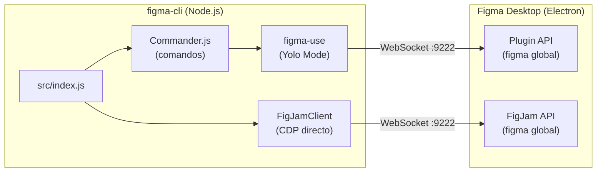

# Arquitectura — Visão Geral
#figma-cli #arquitectura #cdp #ligação

> [!IMPORTANT]
> O figma-cli não usa a Figma REST API. Liga directamente ao Figma Desktop via Chrome DevTools Protocol (CDP) e executa JavaScript no contexto da Plugin API. Sem API key, sem rate limits.

---

## Como os dois processos comunicam



---

## Stack tecnológica

| Componente | Papel |
|------------|-------|
| **Chrome DevTools Protocol** | Protocolo de comunicação com o Figma Desktop (app Electron) na porta 9222 |
| **figma-use** | Biblioteca que abstrai a ligação CDP e a execução de JS para Figma Design |
| **FigJamClient** | Cliente CDP próprio para FigJam (o `figma-use` crasha em FigJam) |
| **Commander.js** | Parser de comandos e flags da CLI |
| **Daemon** | Processo background que mantém a ligação activa para respostas 10× mais rápidas |

---

## Fluxo de ligação (Yolo Mode)

**Como funciona:**
1. `connect` detecta o caminho do executável do Figma Desktop no macOS
2. Patcha o ficheiro de configuração para adicionar `--remote-debugging-port=9222`
3. Reinicia o Figma com a flag activa
4. Inicia o daemon em background
5. O daemon mantém a ligação WebSocket aberta permanentemente

**Código:** `src/index.js` → comando `connect` + função `startDaemon()`

---

## Fluxo de ligação (Safe Mode)

**Como funciona:**
1. `connect --safe` não modifica o Figma
2. O plugin de desenvolvimento `FigCli` é carregado manualmente no Figma
3. O plugin expõe um WebSocket local que o CLI usa
4. Cada sessão requer activar o plugin: Plugins → Development → FigCli

> [!WARNING]
> Em Safe Mode, `render-batch` **não renderiza texto correctamente**. Para componentes com texto, usar `eval` com a Figma API nativa directamente.

---

## Comparação Yolo vs Safe Mode

| Aspecto | Yolo Mode | Safe Mode |
|---------|-----------|-----------|
| Modificação ao Figma | Sim (uma vez) | Não |
| Requere acção manual por sessão | Não | Sim (activar plugin) |
| `render-batch` com texto | ✅ | ❌ |
| Todos os outros comandos | ✅ | ✅ |
| Timeout | 60s | 60s |

---

## Daemon

O daemon é iniciado automaticamente após `connect`. Mantém a ligação activa e processa comandos sem overhead de nova ligação.

```bash
node src/index.js daemon status     # Ver se está activo
node src/index.js daemon restart    # Reiniciar se crashar
```

**Código:** `src/index.js` → `startDaemon()`, `daemonExec()`

---

## Por que não a REST API?

| Feature | REST API | Plugin API (figma-cli) |
|---------|----------|------------------------|
| Requer API key | Sim | Não |
| Rate limits | Sim | Não |
| Acesso a variable modes | Limitado | Completo |
| Escrita directa no ficheiro | Não | Sim |
| Anotações nativas | Não | Sim |

---

## Ficheiros principais

| Ficheiro | Linhas | Função |
|----------|--------|--------|
| `src/index.js` | ~3000+ | Ponto de entrada — todos os comandos da CLI |
| `src/blocks/dashboard-01.js` | — | Layout dashboard pré-construído |
| `audit/rules.md` | — | Regras de auditoria em formato Obsidian |
| `audit/backlog.md` | — | Items detectados para revisão |
